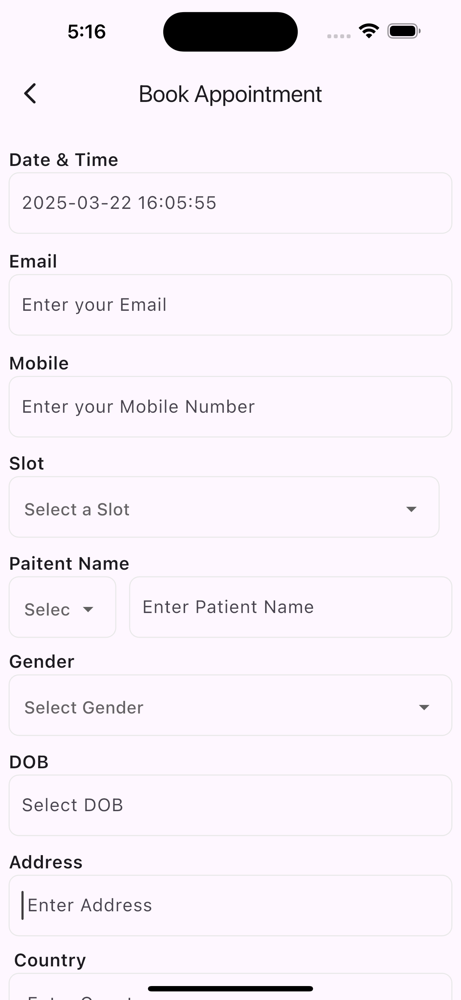

 Hospital UI App

A beautifully designed Flutter UI for a hospital booking and consultation app.
This project focuses on clean design, intuitive user experience, and can be used as a base for any healthcare-related mobile application.

 Features
🩺 Doctor List Screen
📅 Booking Interface (Appointment UI)
🧘‍♂️ Clean layout, icons, and smooth scrolling
⚡ Built with Flutter 3 & Dart

### 📸 Screenshots

#### App Home Screen:

#### Booking Screen:

#### Confirmation Screen:

 Tech Stack
Flutter (UI toolkit by Google)
Dart (programming language)
Android Studio for development
